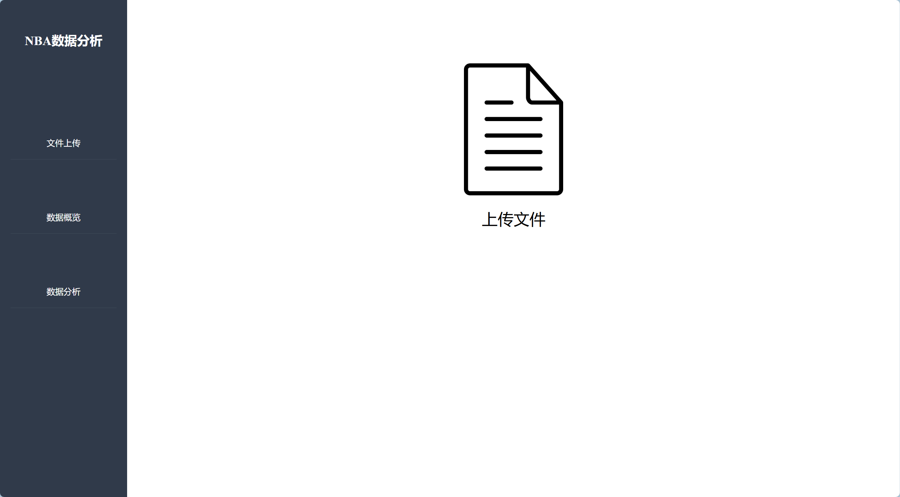
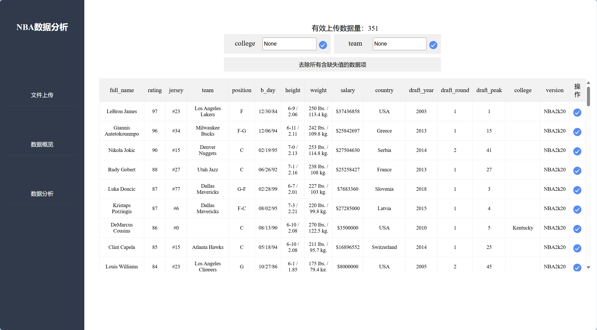
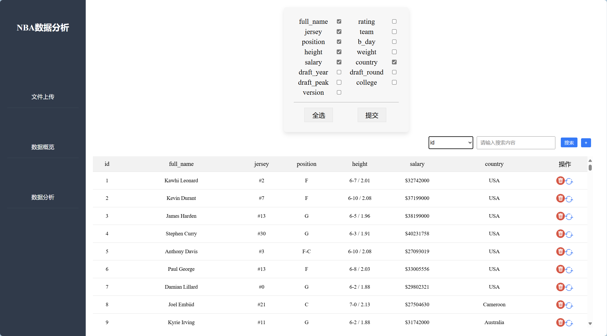
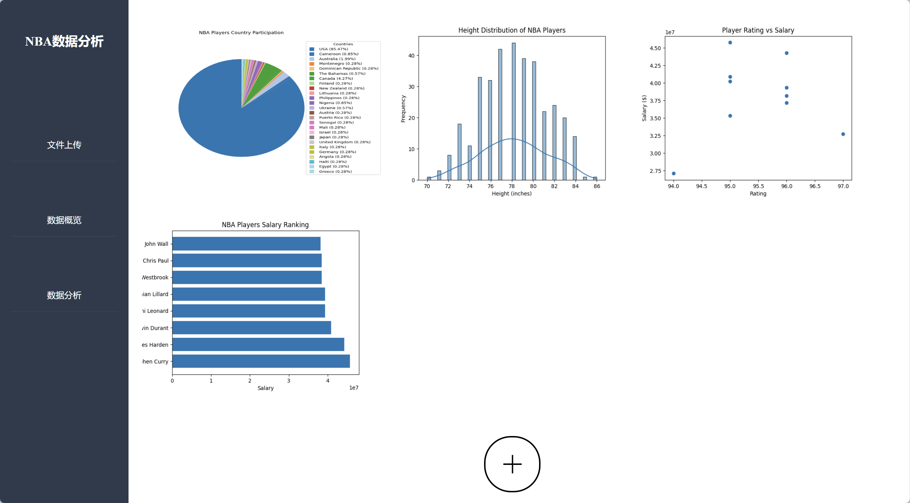

# NBA-DataAnalysis
Small project. Don't spray if you don't like it

The project use vue3 and django

the home page

upload files

table check

data explore

that's all. It's so small.
If this is useful to you, you can download it as your own study material.
